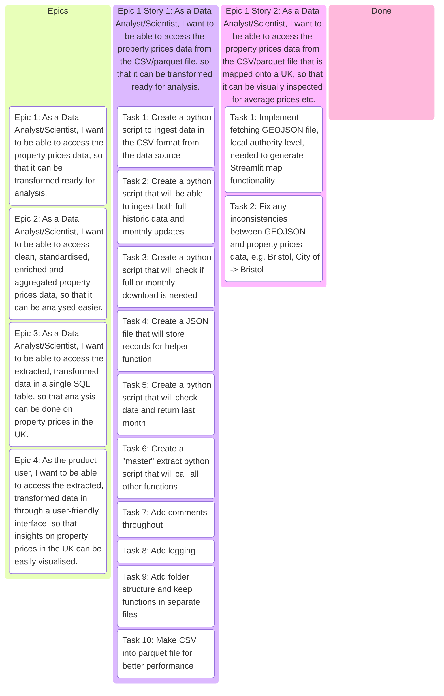
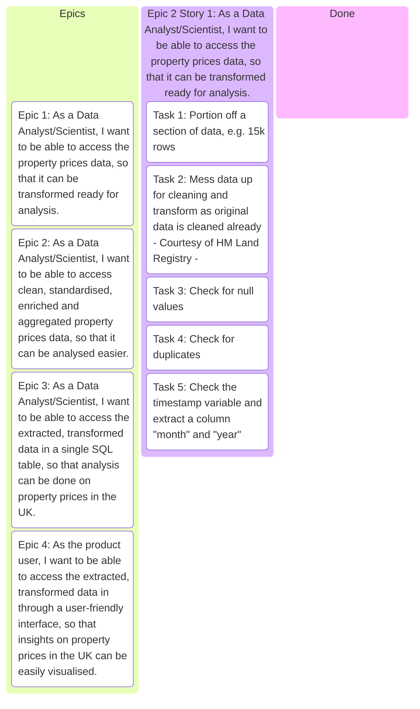

## PROJECT REQUIREMENTS

A customer has approached us with a requirement to create a data set that their Data Analysts and Data Scientists can work with.

The customer requires a robust ETL pipeline to integrate transaction data from a SQL database and demographic data from a CSV file. The pipeline must clean and standardise the data, remove invalid or incomplete records, and retain only active customers who have spent over $500. Additionally, it should enrich the dataset by calculating total customer spending and average transaction value per customer. This is so the company can target high-value customers with relevant marketing and rewards.  The final dataset must be stored in SQL and updated regularly for accurate analysis.

---


## PROJECT REQUIREMENTS AS AN EPIC

```text
As a THE CUSTOMER,
I want a robust ETL pipeline that integrates, cleans, standardises, and enriches transaction and demographic data from SQL and CSV sources, retaining only active customers who have spent over $500 and calculating total and average spend per customer,
So that high-value customers can be identified and targeted with marketing and rewards, using an up-to-date dataset stored in SQL for accurate analysis.
```

---


## EPIC 1

```text
As a Data Analyst/Scientist,
I want to be able to access the property prices data,
So that it can be transformed ready for analysis.
```

---


## EPIC 2

```text
As a Data Analyst/Scientist,
I want to be able to access clean, standardised, enriched and aggregated property prices data,
So that it can be analysed easier.
```

---


## EPIC 3

```text
As a Data Analyst/Scientist,
I want to be able to access the extracted, transformed data in a single SQL table,
So that analysis can be done on property prices in the UK.
```

---

## EPIC 4

```text
As the product user,
I want to be able to access the extracted, transformed data in through a user-friendly interface,
So that insights on property prices in the UK can be easily visualised.
```

---

## EPIC 1 Breakdown

```text
As a Data Analyst/Scientist,
I want to be able to access the property prices data,
So that it can be transformed ready for analysis.
```

---

### USER STORY 1

```text
As a Data Analyst/Scientist,
I want to be able to access the property prices data from the CSV file,
So that it can be transformed ready for analysis.
```

### USER STORY 2

```text
As a Data Analyst/Scientist,
I want to be able to access the customer data from the parquet file,
So that it can be transformed, ready for analysis
```

### USER STORY 3

```text
As a Data Analyst/Scientist,
I want to be able to perform monthly updates,
So new data can be added to the dataset.
```


---
---

## EPIC 2 Breakdown

```text
As a Data Analyst/Scientist,
I want to be able to access clean, standardised, enriched and aggregated data,
So that it can be analysed easier
```

### USER STORY 3

```text
As a Data Analyst/Scientist,
I want to be able to access cleaned, standardised transaction data,
So that it can be combined with the customer data and made available as a single table
```

### USER STORY 4

```text
As a Data Analyst/Scientist,
I want to be able to access cleaned, standardised customer data,
So that it can be combined with the transaction data and made available as a single table
```

###  USER STORY 5

```text
As a Data Analyst/Scientist,
I want to be able to access the combined, enriched and aggregated transaction and customer data,
So that it can be analysed easier
```

---
---

## EPIC 3 Breakdown

```text
As a Data Analyst/Scientist,
I want to be able to access the extracted, transformed data in a single SQL table,
So that analysis can be done on high value customers
```

### USER STORY 6

```text
As a Data Analyst/Scientist,
I want the cleaned, standardised, enriched and aggregated data to be available in a single SQL table,
So that it can be analysed easier
```

---



