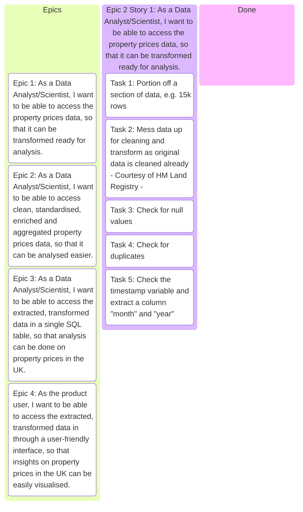

## PROJECT REQUIREMENTS

Property Pulse UK aims to provide users with a powerful property price search tool and, eventually, predictive insights for future property values using machine learning.

The project requires a robust ETL pipeline to automatically download monthly UK property price data from the Land Registry’s public dataset, store it in a structured format, and prepare it for both analysis and application use. The pipeline must:
- Fetch new monthly data from a fixed URL.
- Store each month’s dataset in a versioned folder structure (data/raw/YYYY-MM).
- Clean and standardise the data, handling missing values and ensuring consistent formats (e.g., dates, currency, location fields).
- Integrate and combine monthly datasets into a unified historical dataset.
- Prepare the dataset for use in a Streamlit web application, enabling property searches by location, price range, and other filters.
- Maintain a history of all updates to support both current and retrospective property market analysis.

The final processed dataset will form the backbone of the Property Pulse UK app, supporting user-friendly search and future ML-driven property price predictions.

---

## PROJECT REQUIREMENTS AS AN EPIC

```text
As a DA/DS and PROPERTY PULSE UK USER,
I want a robust ETL pipeline that automatically fetches, 
cleans, and standardises monthly UK property price data 
from public Land Registry CSV sources, storing each update 
in a versioned format and merging it with historical records,
So that I can search, analyse, and track property price trends 
over time in the Property Pulse UK app, and in the future, 
receive data-driven predictions on property values
powered by machine learning.
```

---


## EPIC 1

```text
As a Data Analyst/Scientist,
I want to be able to access the property prices data,
So that it can be transformed ready for analysis.
```

---


## EPIC 2

```text
As a Data Analyst/Scientist,
I want to be able to access clean, standardised, enriched and aggregated property prices data,
So that it can be analysed easier.
```

---


## EPIC 3

```text
As a Data Analyst/Scientist,
I want to be able to access the extracted, transformed data in a single SQL table,
So that analysis can be done on property prices in the UK.
```

---

## EPIC 4

```text
As the product user,
I want to be able to access the extracted, transformed data in through a user-friendly interface,
So that insights on property prices in the UK can be easily visualised.
```

---

## EPIC 1 Breakdown

```text
As a Data Analyst/Scientist,
I want to be able to access the property prices data,
So that it can be transformed ready for analysis.
```

---

### USER STORY 1

```text
As a Data Analyst/Scientist, 
I want to be able to access the property prices data 
from the CSV/parquet file, so that it can be 
transformed ready for analysis.
```

### USER STORY 2

```text
As a Data Analyst/Scientist, 
I want to be able to access the property prices data 
from the CSV/parquet file that is mapped onto a UK,
so that it can be visually inspected for average prices by region
```

---


---

