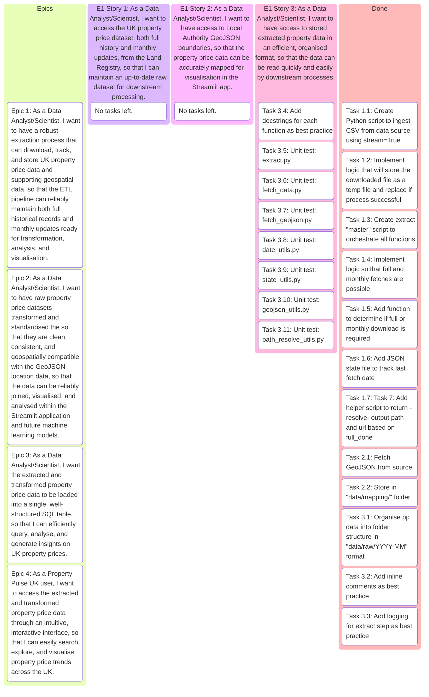
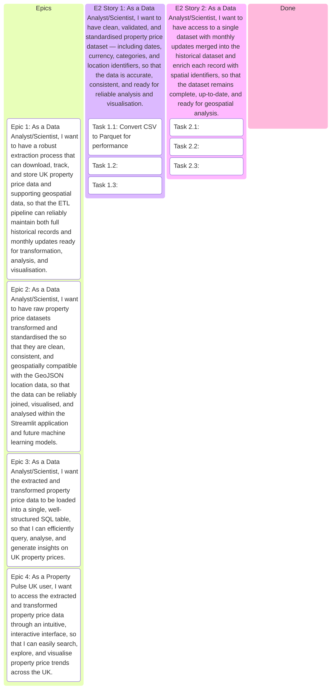

## PROJECT REQUIREMENTS

Property Pulse UK aims to provide users with a powerful property price search tool and, eventually, predictive insights for future property values using machine learning.

The project requires a robust ETL pipeline to automatically download monthly UK property price data from the Land Registry’s public dataset, store it in a structured format, and prepare it for both analysis and application use. The pipeline must:
- Fetch new monthly data from a fixed URL.
- Store each month’s dataset in a versioned folder structure (data/raw/YYYY-MM).
- Clean and standardise the data, handling missing values and ensuring consistent formats (e.g., dates, currency, location fields).
- Integrate and combine monthly datasets into a unified historical dataset.
- Prepare the dataset for use in a Streamlit web application, enabling property searches by location, price range, and other filters.
- Maintain a history of all updates to support both current and retrospective property market analysis.

The final processed dataset will form the backbone of the Property Pulse UK app, supporting user-friendly search and future ML-driven property price predictions.

---

## PROJECT REQUIREMENTS AS AN EPIC

```text
As a DA/DS and PROPERTY PULSE UK USER,
I want a robust ETL pipeline that automatically fetches, 
cleans, and standardises monthly UK property price data 
from public Land Registry CSV sources, storing each update 
in a versioned format and merging it with historical records,
So that I can search, analyse, and track property price trends 
over time in the Property Pulse UK app, and in the future, 
receive data-driven predictions on property values
powered by machine learning.
```

---

## EPIC 1

```text
As a Data Analyst/Scientist,
I want to have a robust extraction process that can download, 
track, and store UK property price data and supporting geospatial 
data, so that the ETL pipeline can reliably maintain both full 
historical records and monthly updates ready for transformation, 
analysis, and visualisation.
```

## EPIC 2

```text
As a Data Analyst/Scientist,
I want to transform and standardise the raw property 
price datasets so that they are clean, consistent, and 
geospatially compatible with the GeoJSON location data,
so that the data can be reliably joined, visualised, and
analysed within the Streamlit application and future 
machine learning models.
```

## EPIC 3

```text
As a Data Analyst/Scientist,
I want the extracted and transformed property price data 
to be loaded into a single, well-structured SQL table, 
so that I can efficiently query, analyse, and generate 
insights on UK property prices.
```

## EPIC 4

```text
As a Property Pulse UK user,
I want to access the extracted and transformed property 
price data through an intuitive, interactive interface, 
so that I can easily search, explore, and visualise 
property price trends across the UK.
```

---

## EPIC Breakdown

### EPIC 1

```text
As a Data Analyst/Scientist,
I want to have a robust extraction process that can download, 
track, and store UK property price data and supporting geospatial 
data, so that the ETL pipeline can reliably maintain both full 
historical records and monthly updates ready for transformation, 
analysis, and visualisation.
```

#### USER STORY 1

```text
As a Data Analyst/Scientist,
I want to access the UK property price dataset, both 
full history and monthly updates, from the Land Registry, 
so that I can maintain an up-to-date raw dataset for 
downstream processing.
```

#### USER STORY 2

```text
As a Data Analyst/Scientist,
I want to have access to stored extracted property data 
in an efficient, organised format, so that the data can be 
read quickly and easily by downstream processes.
```

#### USER STORY 3

```text
As a Data Analyst/Scientist,
I want to have access to Local Authority GeoJSON boundaries,
so that the property price data can be accurately mapped for 
visualisation in the Streamlit app.
```

---

### EPIC 2

```text
As a Data Analyst/Scientist,
I want to transform and standardise the raw property 
price datasets so that they are clean, consistent, and 
geospatially compatible with the GeoJSON location data,
so that the data can be reliably joined, visualised, and
analysed within the Streamlit application and future 
machine learning models.
```

#### USER STORY 1

```text
As a Data Analyst/Scientist,
I want to have clean, validated, and standardised property 
price dataset — including dates, currency, categories, and 
location identifiers, so that the data is accurate, consistent, 
and ready for reliable analysis and visualisation.
```

#### USER STORY 2

```text
As a Data Analyst/Scientist,
I want to have access to a single dataset with monthly updates merged into the historical 
dataset and enrich each record with spatial identifiers, 
so that the dataset remains complete, up-to-date, and 
ready for geospatial analysis.
```

### EPIC 3

```text
As a Data Analyst/Scientist,
I want the extracted and transformed property price data 
to be loaded into a single, well-structured SQL table, 
so that I can efficiently query, analyse, and generate 
insights on UK property prices.
```

### EPIC 4

```text
As a Property Pulse UK user,
I want to access the extracted and transformed property 
price data through an intuitive, interactive interface, 
so that I can easily search, explore, and visualise 
property price trends across the UK.
```

---

## KANBAN BOARD
### EPIC 1 User stories and tasks




### EPIC 2 User stories and tasks

